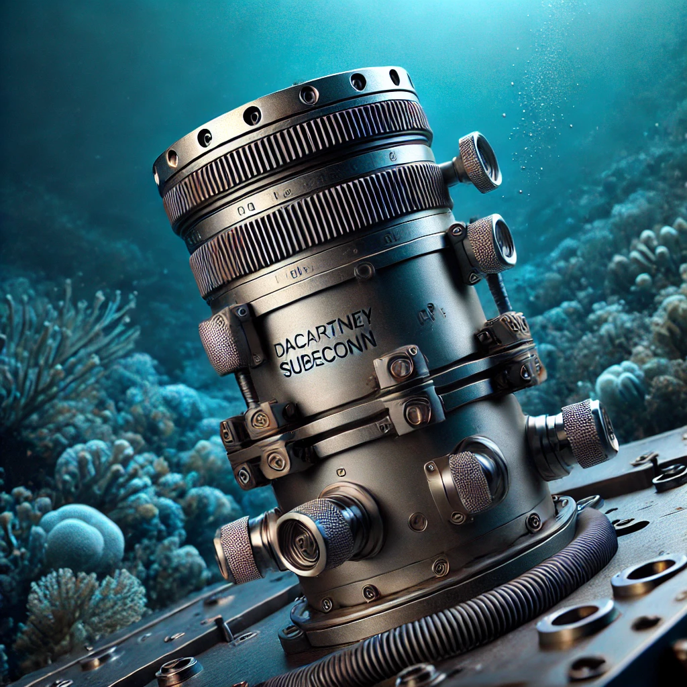
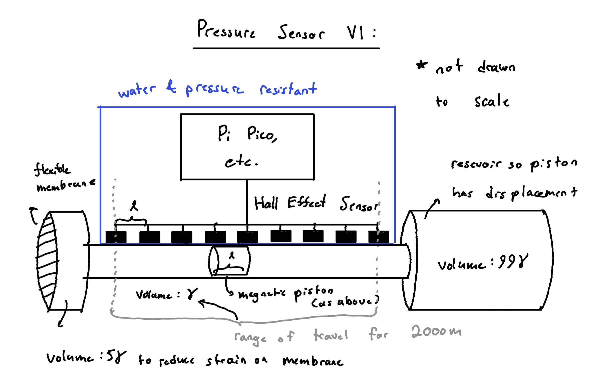
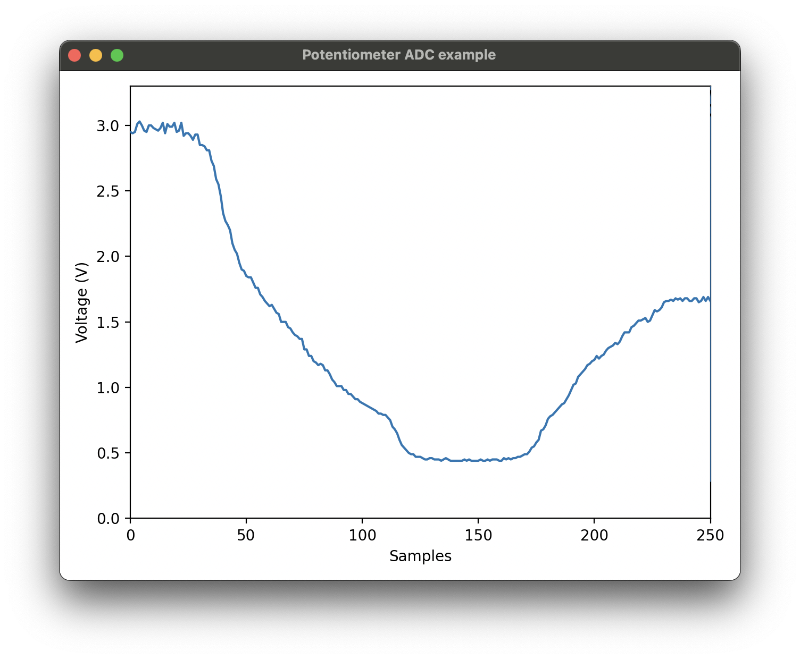
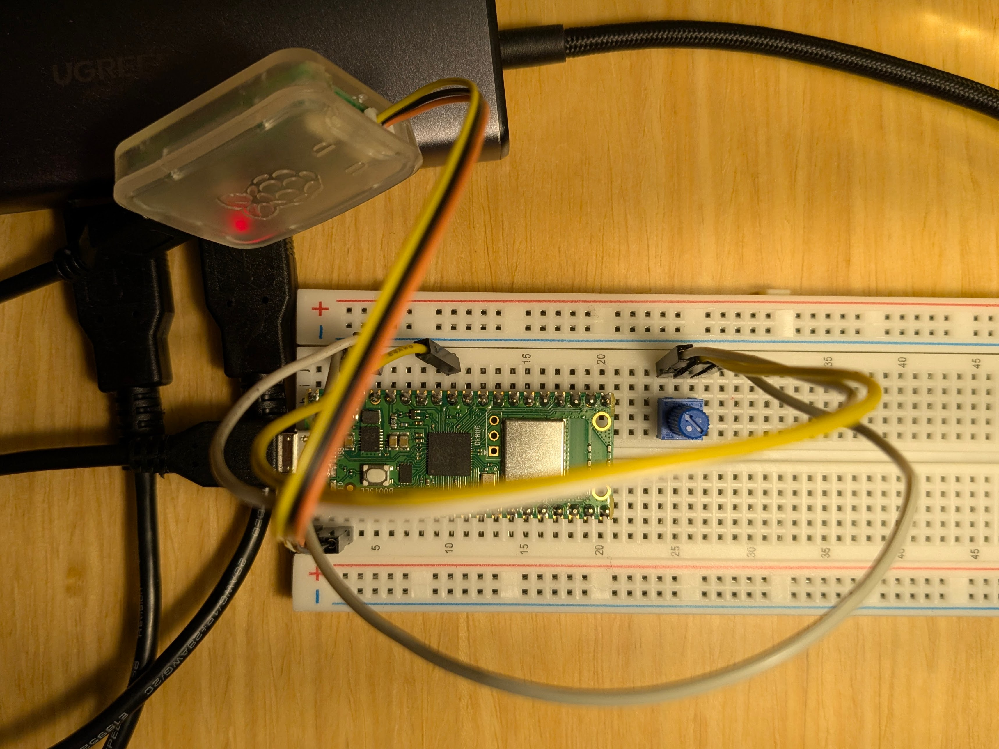
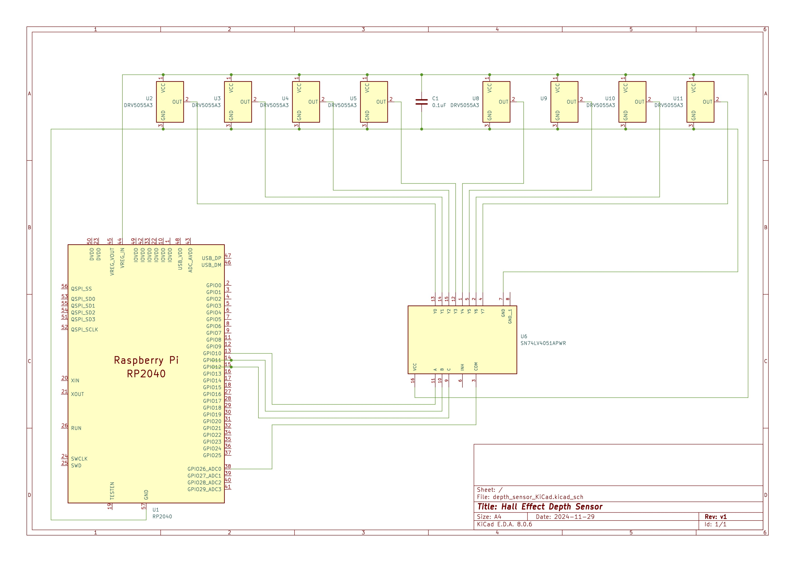

## Low-Cost Depth Sensing Module For Deep-Water Instruments

  

  AI-generated image of a depth sensor

  

  Or here's what the current prototype will look like

A low-cost, durable depth-sensing module capable of providing approximate depth readings for underwater instruments submerged up to 2000 meters. Deliverables will include a fully functional prototype, field-tested for real-world integration.

> in Partial Fulfillment of the Requirements for the Degree of Master of Engineering, Electrical and Computer Engineering at Cornell University

### Introduction

This project addresses the challenge of developing a cost-effective depth sensor for intermediate to deep depths (up to 2000 meters). Existing solutions are either prohibitively expensive or unsuitable for these depths. In collaboration with Dr. V. Hunter Adams (Cornell ECE) and Jonathan Pfeifer (WHOI), this effort focuses on creating a robust, affordable sensor module designed for integration with underwater exploration vessels. The sensor balances practical accuracy with resilience to high-pressure underwater environments, supporting WHOI’s marine research with an innovative and accessible solution.

### Updates

> Recent on top and older on bottom

#### Potential epoxy options

> Mar 2025

We need ~ 100ml of epoxy to encapsulate electronics and custom break out Pi Pico.

#### Calculating number of hall effect sensors

> Feb 2025

The specification is to be able to work across the 2000m range with a resolution of +/- 10m. 

Thus, the minimum resultion we need to have is 2000m / 10m = 200 points.

From [this article](https://pico-adc.markomo.me/ENOB/), the effective bits of the Pi Pico ADC is approximatle **8.8 bits**.

With a conservative estimate, this is around 2 ^ 8.8 ~ 400 discrete values not affected by noise internal to the ADC

As we can see, even having one hall effect sensor would be enough and would get us to within 5m resolution. 

Since there are three ADCs available on the Pi Pico and the Hall Effect sensors are quite inexpensive, why not utilize three three hall effect sensors for approximately a 3 * 400 ~ 1200 point resolution. For the range of 2000m, this leads to a precision of about 1.67m.

Going beyond that has little benefit

#### Acquiring and plotting live ADC data

> Jan 2025

Wrote program to output ADC data over serial and to a real-time plotter program on my computer where I was measuring the voltage from a potentiometer. This program will serve as a good way to characterize the future hall-effect sensors.

  

  Live plot of ADC plotter

  

  Breadboard setup of potentiometer

#### Initial PCB design

> Nov 2024

Designed PCB schematic found in /depth_sensor_KiCad as per image below:

  

  Image of schematic

#### Exploring physical mechanisms with which to measure pressure

> Oct 2024

Compressible fluids research: https://hackmd.io/@nekrutnikolai/rJiTfUMA0

We decided to initially move forward with an approach that utilizes the linear compressibility of liquids, such as sea water, under high pressure. These linearly compressible liquids, such as water or ethanol exhibit an interesting property where their change in volume is linear with respect to pressure rather than a 1/x relationship. The change in volume at a depth of 2000m, which is a pressure of 200 atm is approximately 1% less than atmospheric volume. The prototype will work by having a piston composed of a magnet that moves as the fluid is compressed more and more at greater depths. The position of the magnet is to be determined precisely by using a linear array of hall effect sensors as this is a non-invaise way to measure the position of the magnet.

<!-- Components have arrived but turns out that I received the wrong ones: -->

### Specifications to Meet

| **Parameter**      | **Specification**               |
|---------------------|---------------------------------|
| **Depth**          | 2,000 m                         |
| **Pressure**       | 200 atm                         |
| **Power Input**    | 5-24V @ ≤ 100mA                 |
| **Data Protocol**  | RS-232                          |
| **Physical Size**  | Soda can - Nalgene bottle sized |
| **Connector Type** | MacArtney SubConn               |
| **Accuracy**       | ±10 m                           |
| **Mounting**       | Hose clamps, bolts, etc.        |

### Timeline  
This project spans two semesters: **FA 2024 - SP 2025** with the following timeline:  

#### Fall 2024 Semester  
- ✅ **Sep-Nov**: Conduct research and finalize physical sensing mechanism  
- ✅ **Nov**: Order components  
- ⬜ **Dec**: Design circuit PCB (in progress)  
- ⬜ **Dec**: Initial testing with ordered components (in progress)  

#### Spring 2025 Semester  
- ⬜ **Jan-Feb**: Design algorithm to translate physical system into depth readings  
- ⬜ **Jan-Feb**: Assemble prototype & test at Helen Newman Pool  
- ⬜ **Feb**: Complete interface design and implement energy-efficient adjustments  
- ⬜ **Feb-Mar**: Integrate final hardware and software, prepare for field testing  
- ⬜ **Mar-Apr**: Perform field testing with WHOI; collect data and refine design  
- ⬜ **May**: Finalize module, complete documentation, and hand over the prototype to WHOI  

